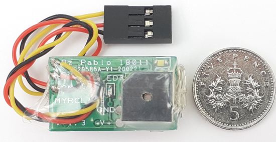
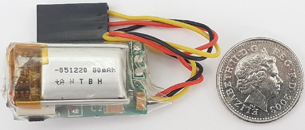
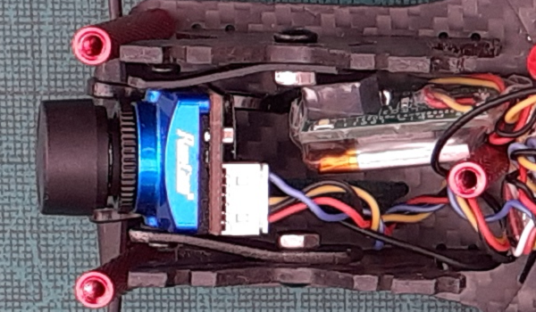
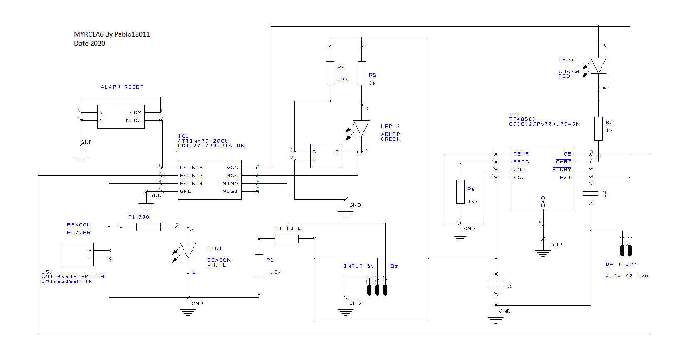
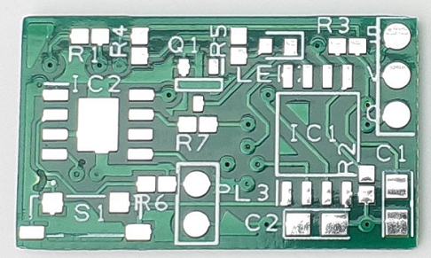
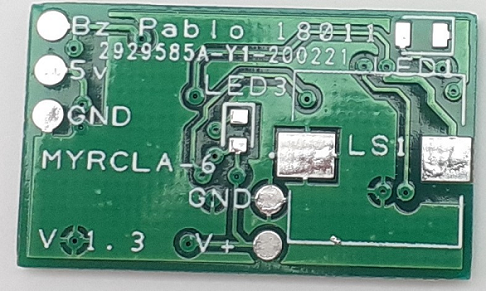
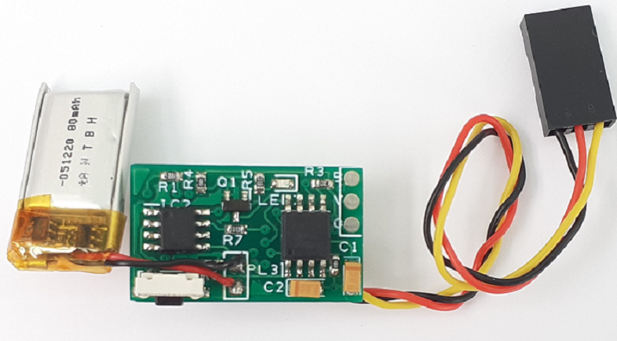
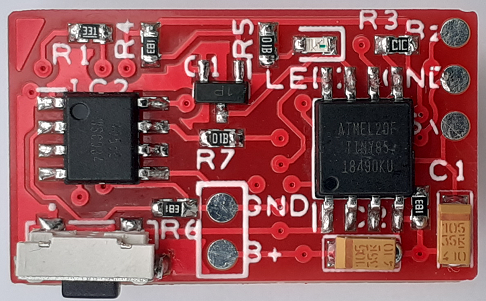
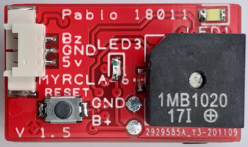
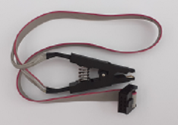

# MYRCLA6
This is my version of an RC lost alarm.
I decided to try and make my own when I bought a [DroneKeeper Mini](https://www.nichemall.net:11846/index.php?route=product/product&product_id=50) when they first appeared.
I thought how hard can it be? When you don’t know anything about coding… turns out it’s very hard!
The reason for building this was to learn coding, get back into electronics and make my own
version of a RC lost alarm to fit to my Quadcopters and Planes.Here is a [video](https://www.youtube.com/watch?v=A2OlpAuxzVI&feature=youtu.be) of my MYRCLA6 in operation .I also wanted to contribute something back into the community.
To pass forward what I have learned as thanks to everyone who provides teaching and information
for free and no other reason, than they want to and enjoy sharing knowledge.

MYRCLA6 ≈ Size 5p/1cent

 

MYRCLA6 in a 5" Quad

## Main Components

The microchip is the Atmel ATtiny 85 and a TP4056 PMIC,double-sided PCB,
buzzer and LED used for location, 3.7V 80 mAh lipo battery.

## Description and Operation

[MYRCLA6](https://www.youtube.com/watch?v=A2OlpAuxzVI&feature=youtu.be) is a small self-powered RC lost alarm location device (25x15mm 6 grams)
that can help you locate your lost Quadcopter/Plane, either by a configured buzzer switch
on a TX or if the main battery is disconnected a continuous S.O.S alarm.
There is no on/off switch as MYRCLA6 is in lower power mode (sleep) by default.
In this state the power consumption is very low > 1 µA, 100mV/3 months!
If fully charged it will take 12 months to drop to 3.8V (storage).

Connection is to a flight controller/RX receiver via a +5V line, GND and Bz out.
When the RC model battery is connected the 5v line will wake up the ATtiny 85. 
A series of beeps and LED 1 (White) flashes will indicate the approximate voltage of the built in lipo,
1 x < 3.9V, 2 x >3.9V-4.1V<, 3 x >4.1V.
LED 2 (Green) will indicate MYRCLA6 is armed and LED 3 (Red) will be on if internal lipo battery is charging and off when not.
The buzzer will act as a normal Betaflight status indicator and a switch activated buzzer when configured.
If the model’s main battery is disconnected (either crash or the end of a flight) there will be a 5 second delay,
then the buzzer and LED 1 Beacon (White) will sound and light S.O.S continuously.
S.O.S will only cease when either the battery is reconnected, the reset push button is pressed or
the internal lipo battery drops below 3V, testing on a 90% charge of the internal lipo was 12hrs
Continuous S.O.S alarm.

## Schematic

## PCB
I created the PCB and schematic using [DesignSpark PCB 9.0](https://www.rs-online.com/designspark/pcb-download-and-installation) (free version from RS Components)
I built some prototypes using the toner transfer method on copper clad and etched with Ferric Chloride, I just hand drilled the via's (carefully!).
I then used single strands of copper wire through the holes and soldered each side.
When I was happy my design worked I ordered 10 PCBs from [JLCPCB manufacturer](https://cart.jlcpcb.com/?edaOrderUrl=https:%2F%2Feasyeda.com%2Forder&electropolishingOnlyNo=no&achieveDate=72#%2F%3ForderType=1&stencilWidth=30&stencilLength=15&stencilCounts=5&stencilLayer=2&stencilPly=1.6&steelmeshSellingPriceRecordNum=A8256537-5522-491C-965C-646F5842AEC9&purchaseNumber=) very reasonable £10 for 10 and arrived in a few weeks, very good quality and good comunication I would highly recommend.
I have provided a zip of the PCB Gerber files generated in [DesinSpark PCB 9.0](https://www.rs-online.com/designspark/pcb-download-and-installation)
You may be able to order just using Y1-2929585A PCB order number printed on the PCB in the photograph.

 | 

## UPDATE   V 1.5 PCB
I have changed the original PCB To have a 2nd reset tactile push switch and a 3 pin standard FPV MOLEX PicoBlade SMD connector.
These design changes allow for a MYRCLA6 to be easily moved to other models and to make it safer to install on your FC.
The connector and cable are a standard PicoBlade 1.25mm pitch used on FPV cameras and cable colour code is the same.
You still have the option to direct solder cables as for V 1.4.

 | 

## Components

All components are SMD, ICs [ATtiny 85](https://uk.rs-online.com/web/p/microcontrollers/1331674/) and [TP4056](https://www.ebay.co.uk/itm/P4056-4-2V-3A-High-Current-Lithium-Battery-Charging-Board-Charger-Module/152989287050?hash=item239edf428a:g:bs8AAOSwLRla2H-Y), LEDs, resistors and capacitors are 0603 and 0805 size. I used a soldering iron and a magnifier to build mine, but you could use a stencil and solder paste. I have included a list; the capacitor values are not that critical. I oversized some of the pads in the PCB circuit design to have flexibility for the chosen components, like LS1 buzzer size can vary by a few mm and still fit, if you can’t find the same one as I used.
All components are fairly common and should be easy to source. (eBay and China!)
The lipo battery I used has a built-in protection circuit, but does not cut in until below 3V.
So, if you do completely drain the battery after loosing your Quadcopter/Plane, replace it!
Do not recharge it…!

## The Code

I used [Arduino IDE ver 1.8.5](https://www.arduino.cc/en/main/software) to create and compile the code.
This is my first project Coding,Arduino and Github, so apologies in advance where I have made mistakes as I’m
still learning. The Arduino forum helped a lot and code other users posted which I have adapted to
suit this project, my first code used a lot of delay, until I found [Grumpy_Mike’s](http://www.thebox.myzen.co.uk/Tutorial/State_Machine.html) version of S.O.S without delay. Measuring the internal lipo voltage was achieved by [Secret Arduino Voltmeter](https://www.instructables.com/id/Secret-Arduino-Voltmeter/)
I also referenced this version of a RC lost alarm 
[NMLB](https://github.com/DavidMarzocca/NMLB), 
also the data sheets for the ATtiny 85 and TP4056, this includes a charging circuit example I used and adapted, the same as [NMLB](https://github.com/DavidMarzocca/NMLB) used.

I built my own AVR ISP to program the ATtiny 85 using a Arduino Pro Mini,SOIC8 SOP8 to DIP8 200mil EZ Programmer Adapter Socket, FTDI and ArduinoISP version 04m3 by Randall Bohn.
A SOIC8 SOP8 Flash Chip IC Test Clips Socket Adpter BIOS/24/25/93 can be used to reprogram the ATtiny 85 whilst still on the PCB, if needed.
You can also use [Arduino Uno](https://dev.mikamai.com/2014/03/05/how-to-program-an-attiny85-or-attiny45-with-an/).

AVR/ISP

IC Test Clip

Why make a RCLA when you can buy one for as little as £10?
I have tested a few and found a popular version that consumes more current in standby than MYRCLA6 and does not always sound an alarm when the battery is disconnected...!
Well you will not save any money however you may learn something and find your model!

I have included notes in the code and also a resources folder to give more detail about the code and
anything else that may help anyone interested in making one.

## Improvements?
Code tweeking, optimizing? Correct for errors?
I would like to see the internal battery voltage reported to Betaflight when MYRCLA6 is activated, so it could be displayed briefly in FPV goggles prior to take off?
Reduce the size? This would only be by 5mm length as you are limited by the lipo battery size.
Suggestions, requests and/or help will be appreciated, but please bear in mind I’m new to
coding and limited on how much time I can allocate to this project.

